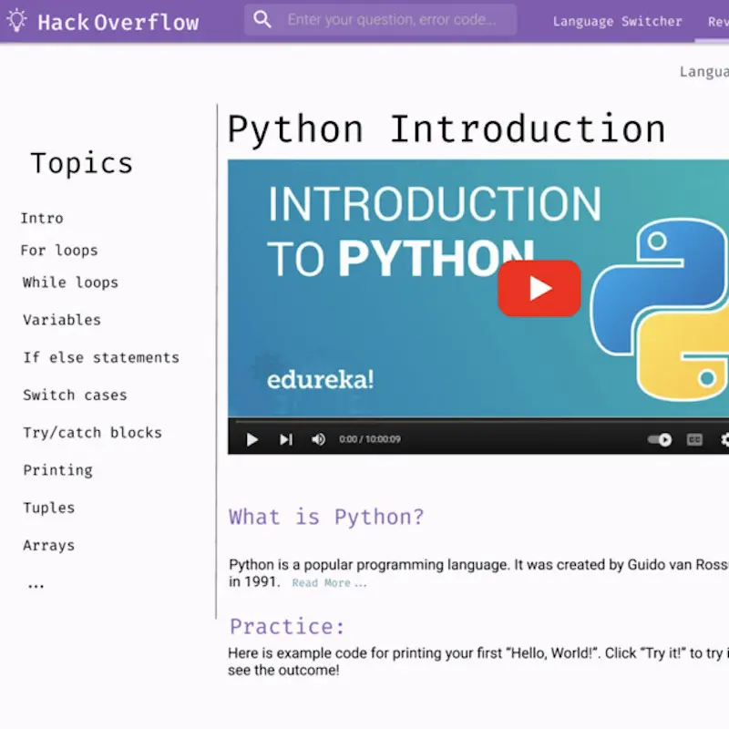

# hack-overflow

Stack Overflow for beginners!

For BYU CS 356 UI Design class, we were tasked with coming up with a web app to build. Having recently been absolute beginners to programming, we had felt the pain of hitting the wall and having to google our issue, then being faced with an equally confusing Stack Overflow page. This solution aims to simplify stack overflow by distilling down all the relevant information to a few actionable steps. The designs you'll see below were done in Figma. No attempt has yet been made to make this into an actual website, largely in part due to the rise of AI that came after this idea's inception and how it solves this pain point so well.

Big Idea Pitch Video: https://youtu.be/dnFgURXY3UM

For full-size screenshots and for descriptions of the different pages see the [Complete HackOverflow PDF](./hack-overflow.pdf).
